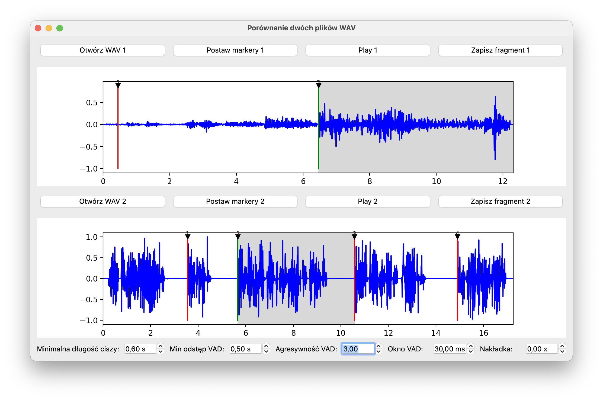

# 🎙️ Voice-Over Marker Tool (Prototype)

An experimental Python tool for analyzing audio tracks and automatically placing markers before spoken phrases – useful for voice-over preparation, narration timing, or dialogue alignment with video.

---

## ✨ Features

🔊 **Supports two audio tracks with different detection algorithms:**

### 1. **Track A – Studio / Voice Talent**
Uses a **silence-based algorithm** to detect voice phrases.  
A marker is placed **right after a silence of at least N milliseconds** and just **before the start of a new phrase**.

> ✅ Designed for clean, studio-quality recordings (e.g. podcasting, voice acting tests, narration).

### 2. **Track B – Film / Noisy Environment**
Uses the **Silero Voice Activity Detector (VAD)** to detect speech in environments with background noise.

Parameters:
- `vad_aggressiveness` – detection sensitivity
- `vad_window_size_ms` – analysis window size (ms)
- `vad_padding_ms` – pre/post margin for detection
- `marker_offset_ms` – how early before detected speech to place a marker

> 🎥 Useful for movies, interviews, or YouTube videos with ambient sound.

---

## 🖼️ Screenshot / Demo

  
📺 [Watch the YouTube demo](https://www.youtube.com/watch?v=a3E4OpsNdzo)

---

## 🧪 Installation & Setup

This project requires **Python 3.10+**.

### 1. Clone the repository

```bash
git clone https://github.com/YourUsername/voice-over-marker-tool.git
cd voice-over-marker-tool